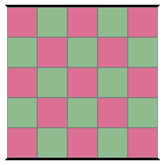

# Konobi game
[](https://travis-ci.org/pindri/konobi)

### Authors
* **Enrico Fallacara**
* **Patrick Indri**
* **Federico Pigozzi**



### Rules

Konobi is a connection game for two players, **black** and **white**, and it's played on a chequerboard. 

* Each player places stone of the corresponding colour on the board;
* Two stones of the same colour are **strongly connected** if they are orthogonally connected;
* Two stones of the colour are **weakly connected** if they are diagonally connected;
* On white's first turn, they can decide to switch colour with the other player instead of placing a stone (**pie rule**);
* If a player cannot make any legal move, they shall pass;
* **Winning condition**: player win when they have connected their own edges.

#### Illegal moves
* It is illegal to make a weak connection with a stone unless it is not possible to make placement which is both strongly connected to that stone and not weakly connected to another stone;
* Cross-cuts (2x2 configuration consisting of two weakly connected white stones and two weakly connected black stones) are illegal.

### Compile and run
For portability, the project is shipped with the `gradlew` (`gradlew.bat` for Windows) executable to run the code without manually handling dependencies.

The console version of the game can be started using:

```
 > ./gradlew runConsole
```
The GUI version of the game can be started using:

```
 > ./gradlew runGUI
```
